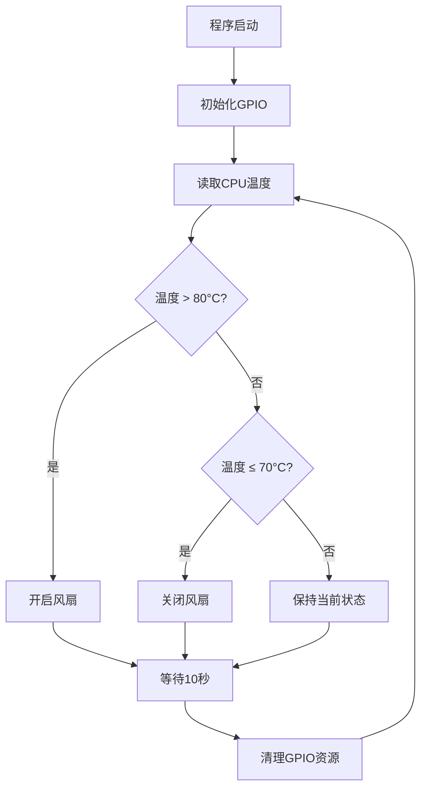

# Raspberry Pi 风扇控制系统项目分析

## 项目概述

**项目名称**: raspberry-fan  
**项目类型**: 树莓派硬件控制工具  
**开发语言**: C++  
**主要功能**: 基于CPU温度自动控制风扇启停

这是一个专为树莓派设计的智能风扇控制系统，通过实时监测CPU温度来自动控制风扇的开启和关闭，有效防止树莓派在高负载运行时过热，延长硬件使用寿命。

## 核心功能

### 温度监控
- 实时读取树莓派CPU温度（从 `/sys/class/thermal/thermal_zone0/temp` 获取）
- 温度数据自动转换（原始数据除以1000得到摄氏度）
- 每10秒检测一次温度变化

### 智能风扇控制
- **启动阈值**: 当CPU温度超过80°C时自动开启风扇
- **停止阈值**: 当CPU温度降至70°C以下时自动关闭风扇
- **GPIO控制**: 使用GPIO引脚14控制风扇开关
- **状态显示**: 实时输出当前温度和风扇状态

### 系统集成
- 支持作为系统服务运行
- 开机自启动
- 后台持续监控

## 技术架构

### 硬件依赖
- **目标平台**: 树莓派（Raspberry Pi）
- **GPIO接口**: 使用GPIO 14引脚控制风扇
- **传感器**: 利用树莓派内置温度传感器

### 软件架构
```
┌─────────────────────────────────────┐
│          raspberry-fan              │
├─────────────────────────────────────┤
│  温度读取模块                       │
│  ├─ /sys/class/thermal/thermal_zone0/temp │
│  └─ 温度数据处理                   │
├─────────────────────────────────────┤
│  控制逻辑模块                       │
│  ├─ 温度阈值判断                   │
│  └─ 风扇启停决策                   │
├─────────────────────────────────────┤
│  GPIO控制模块                       │
│  ├─ pigpio库接口                   │
│  └─ GPIO 14引脚控制                │
└─────────────────────────────────────┘
```

### 关键技术组件

#### pigpio库
- **用途**: GPIO引脚控制
- **优势**: 高精度、低延迟的GPIO操作
- **功能**: 
  - `gpioInitialise()`: 初始化GPIO系统
  - `gpioSetMode()`: 设置引脚模式
  - `gpioWrite()`: 控制引脚输出
  - `gpioTerminate()`: 清理资源

#### 温度监控机制
- **数据源**: Linux系统温度接口
- **采样频率**: 每10秒一次
- **数据格式**: 毫摄氏度转换为摄氏度

## 项目结构分析

```
raspberry-fan/
├── main.cpp              # 主程序源码
├── CMakeLists.txt        # CMake构建配置
├── install.sh           # 自动安装脚本
├── README.md            # 基础说明文档
└── raspberry_fan.service # 系统服务配置文件（安装时创建）
```

### 文件详解

#### main.cpp
核心控制逻辑实现：
- **主循环**: 无限循环监控温度
- **温度读取**: 从系统文件读取CPU温度
- **控制逻辑**: 基于阈值控制风扇
- **GPIO操作**: 使用pigpio库控制硬件

#### CMakeLists.txt
构建配置特点：
- **C++标准**: 要求C++14
- **依赖检查**: 自动检测pigpio库
- **编译目标**: 生成raspberry_fan可执行文件

#### install.sh
全自动部署脚本：
- **环境准备**: 安装必要的编译工具
- **依赖安装**: 自动安装pigpio库
- **编译构建**: 使用CMake编译项目
- **系统集成**: 安装为系统服务并启用

## 安装与部署

### 系统要求
- **操作系统**: Linux（推荐Raspberry Pi OS）
- **硬件**: 树莓派任意型号
- **权限**: 需要root权限（GPIO控制要求）

### 依赖环境
```bash
# 编译工具
- cmake (>= 3.18.4)
- g++/gcc
- make

# 核心库
- pigpio库

# 系统服务
- systemd
```

### 安装步骤

#### 方法一：自动安装（推荐）
```bash
chmod +x install.sh
sudo ./install.sh
```

#### 方法二：手动安装
```bash
# 1. 安装依赖
sudo apt update
sudo apt install cmake g++ gcc pigpio -y

# 2. 编译项目
mkdir build && cd build
cmake ..
make

# 3. 安装程序
sudo cp raspberry_fan /usr/local/bin/

# 4. 配置服务（需要手动创建service文件）
sudo systemctl enable raspberry_fan
sudo systemctl start raspberry_fan
```

### 服务管理
```bash
# 启动服务
sudo systemctl start raspberry_fan

# 停止服务
sudo systemctl stop raspberry_fan

# 重启服务
sudo systemctl restart raspberry_fan

# 查看状态
sudo systemctl status raspberry_fan

# 查看日志
sudo journalctl -u raspberry_fan -f
```

## 配置说明

### 温度阈值配置
当前配置位于 `main.cpp` 中：
```cpp
int maxTemp = 80;  // 风扇启动温度（°C）
int minTemp = 70;  // 风扇停止温度（°C）
```

### GPIO引脚配置
```cpp
int fan = 14;  // 使用GPIO 14控制风扇
```

### 监控间隔配置
```cpp
sleep(10);  // 每10秒检测一次
```

## 使用场景

### 适用环境
1. **高性能计算**: 树莓派用于深度学习、科学计算
2. **长时间运行**: 服务器、NAS等24/7运行场景
3. **密闭空间**: 机箱内部散热需求
4. **工业应用**: 嵌入式系统温度控制

### 硬件连接
```
树莓派GPIO 14 ───── 风扇控制端
树莓派5V电源 ───── 风扇电源正极
树莓派GND ──────── 风扇电源负极
```

## 工作原理

### 控制流程


### 温度控制逻辑
- **滞后控制**: 开启温度(80°C) > 关闭温度(70°C)，避免频繁开关
- **实时响应**: 每10秒检测一次，确保及时响应温度变化
- **安全机制**: GPIO资源正确初始化和清理

## 技术特点

### 优势
1. **低资源占用**: C++实现，内存占用小
2. **实时性好**: 直接GPIO控制，响应迅速
3. **稳定可靠**: 简单逻辑，故障率低
4. **易于部署**: 一键安装脚本
5. **系统集成**: 支持systemd服务管理

### 技术亮点
1. **硬件抽象**: 使用pigpio库实现跨平台GPIO控制
2. **系统集成**: 完整的Linux服务化部署
3. **资源管理**: 正确的GPIO资源初始化和清理
4. **温度读取**: 直接读取系统温度接口，无需额外传感器

## 扩展可能

### 功能扩展
1. **多级风扇控制**: PWM调速支持
2. **温度日志**: 温度数据记录和分析
3. **远程监控**: 网络接口和Web界面
4. **多传感器**: 支持外部温度传感器
5. **智能算法**: PID控制算法优化

### 代码改进
1. **配置文件**: 外部配置文件支持
2. **错误处理**: 更完善的异常处理机制
3. **日志系统**: 结构化日志输出
4. **性能优化**: 减少GPIO初始化频率

## 总结

raspberry-fan是一个精简而实用的树莓派风扇控制解决方案，通过智能温度监控和自动风扇控制，有效解决了树莓派在高负载下的过热问题。项目代码简洁明了，部署便捷，特别适合需要长时间稳定运行的树莓派应用场景。

该项目展现了嵌入式系统开发的典型特征：硬件控制、实时响应、资源约束和系统集成。对于学习树莓派GPIO编程和系统服务开发具有很好的参考价值。